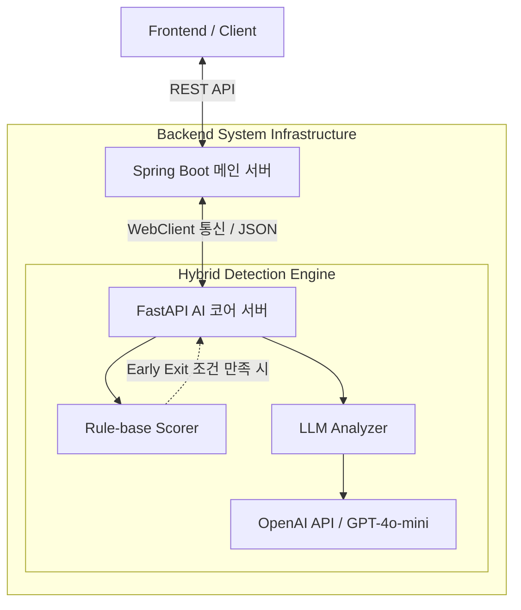

# Phishing-mail-ai

```markdown
# AI 기반 피싱 메일 정밀 분석 및 사용자 보안 리터러시 강화 서비스

## 프로젝트 소개

본 프로젝트는 지능화되는 피싱 이메일 위협으로부터 사용자를 보호하고 디지털 보안 문해력(리터러시)을 향상하기 위한 웹 기반 분석 플랫폼입니다. 단순히 위험 메일을 차단하는 기술적 접근을 넘어, 사용자가 수신한 이메일의 위험 요소를 다차원적으로 평가하고 그 결과를 교육적인 피드백과 함께 시각화하여 제공합니다.

시스템은 명확한 채점 기준과 아키텍처 규격을 충족하기 위해 **Spring Boot 기반의 백엔드 메인 서버**와 AI 및 텍스트 마이닝 연산에 특화된 **FastAPI 기반의 AI 독립 서버**가 유기적으로 연동되는 멀티 서버 아키텍처(Multi-Server Architecture) 환경으로 구축되었습니다. 

## 문제 정의

최근의 피싱 메일은 정교한 사회공학적 기법과 정상 도메인을 위장한 타이포스쿼팅(Typosquatting) 기법을 사용하여 전통적인 규칙 기반 필터링 시스템을 우회하고 있습니다. 이로 인해 일반 사용자가 메일의 진위 여부를 주관적으로 판단하기 어려워지고 있으며, 기술적 차단 시스템의 한계를 보완할 수 있는 사용자 중심의 보안 리터러시 교육과 정밀한 문맥 분석 도구가 부재한 상황입니다.

## 주요 기능

* **Spring Boot 백엔드 서비스 (`backend/`)**
    * 사용자 요청 처리 및 API 엔드포인트 관리 (`POST /api/analyze`)
    * 안정적인 프론트엔드 연동을 위한 CORS 정책 및 라우팅 환경 구성
    * FastAPI AI 서버와의 비동기/동기 통신(WebClient 등)을 통한 데이터 송수신 및 응답 파싱 처리
    * 분석 결과 데이터 가공 및 예외(에러) 핸들링 아키텍처 구축

* **FastAPI AI 코어 엔진 (`backend/core/ai/`, AI 브랜치)**
    * **Rule-base Scorer (`url_analyzer.py`, `scorer.py`):** 정규식을 활용한 이메일 본문 내 URL 추출, 유사 도메인 사칭, IP 직접 접속 패턴, URL 단축 서비스 악용 여부 등 6가지 핵심 위험 패턴 기반 1차 스코어링
    * **LLM Analyzer (`llm_analyzer.py`):** OpenAI API(GPT-4o-mini)를 활용하여 메일 본문의 긴급성, 공포심 유도 등 사회공학적 문맥 유무에 대한 2차 분석 및 최적화된 JSON 포맷 응답 파싱
    * **Early Exit 정책:** 1차 규칙 기반 탐지에서 명확한 위험이 감지될 경우 LLM 연동 과정을 생략하여 분석 리소스와 서버 응답 시간을 최적화하는 하이브리드 탐지 알고리즘 적용

## 기술 스택

### Backend & Serving
* **Framework:** Spring Boot 3.x
* **Language:** Java 17
* **Build Tool:** Gradle
* **Security:** Spring Security, CORS Configuration
* **Communication:** WebClient / RestTemplate (FastAPI 서버 연동용)

### AI Engine & Analysis
* **Framework:** FastAPI
* **Language:** Python 3.x
* **Libraries:** OpenAI API (GPT-4o-mini 모델 활용), tldextract (타이포스쿼팅 탐지용), re (정규식 모듈)
* **Dependencies:** requirements.txt 기준 의존성 반영

## 아키텍처 및 구조



### 다이어그램 구조 설명

* **Spring Boot 메인 서버:** 외부 클라이언트(프론트엔드)와의 단일 접점 역할을 수행하며, CORS 정책 설정 및 `POST /api/analyze` 엔드포인트를 제어합니다. 수신된 이메일 데이터를 AI 서버로 안전하게 서빙하고 응답을 포장합니다. (`backend/main/` 구조 근거)
* **FastAPI AI 코어 서버:** 파이썬 기반의 초경량 비동기 서버로, 하이브리드 탐지 엔진 모듈을 탑재하여 핵심 연산을 전담합니다. (`backend/core/ai/` 및 독립 파이썬 스크립트 근거)
* **Rule-base Scorer:** 정규식 패턴 매칭 및 가중치 매칭 시스템을 통해 악성 URL 구조를 초고속으로 계산합니다. (`url_analyzer.py`, `scorer.py` 근거)
* **LLM Analyzer:** OpenAI API를 호출하여 프롬프트 가이드라인에 따른 문맥 분석 및 JSON 구조화 데이터 처리를 수행합니다. (`llm_analyzer.py` 근거)

## 핵심 구현 포인트

* **스프링부트 - FastAPI 멀티 서버 연동 설계**
* 채점 규격 및 백엔드 안정성 요건을 충족하기 위해 Spring Boot를 메인 컨트롤러로 두고, 인공지능 연산이 필요한 영역만 Python FastAPI 서버로 분리 및 비동기 연동 처리하여 결합도를 낮추고 인프라 확장성을 확보하였습니다.


* **Early Exit 하이브리드 스코어링 알고리즘**
* `url_analyzer.py`와 `scorer.py`에서 패턴 기반의 위험 수준이 임계치를 초과할 경우, 비용이 많이 드는 OpenAI API(LLM) 호출을 생략하고 즉시 결과를 반환하는 알고리즘을 설계하여 API 비용 절감 및 실시간 탐지 응답 속도를 혁신적으로 개선하였습니다.


* **정밀 타이포스쿼팅 탐지 라이브러리 연동**
* 단순히 도메인 텍스트를 매칭하는 수준을 넘어 `tldextract` 라이브러리를 활용해 Subdomain, Domain, Suffix를 정확히 분리하고, 사칭이 의심되는 유사 도메인 패턴을 정밀하게 추출하도록 알고리즘 완성도를 높였습니다.


## 트러블슈팅 및 기술적 고민

### 컴포넌트 경계 붕괴 및 코드 중복 관리 문제

* **문제 상황:** 프로젝트 초기 아키텍처 설계 과정에서 백엔드 환경(파이썬 단일 구조 등)의 소통 미스로 인해, 백엔드 루트 폴더에 AI 파트의 핵심 분석 엔진 소스 코드들이 모듈화되지 않은 채 혼재되어 컴포넌트 간 경계가 무너지고 역할 분담 기여도가 모호해지는 현상이 발생했습니다.
* **해결 방법:** 팀 내 기술 조율을 통해 메인 서버 인프라는 지정된 규격인 **Spring Boot**로 전면 전환하고, AI 파트는 **FastAPI 독립 서버**로 완전히 격리 및 패키지화하였습니다. 또한 기획서 및 문서상의 기여도 선을 재정리하여 백엔드는 서버 구축 및 API 서빙/라우팅에 집중하고, AI 파트는 코어 탐지 엔진(URL 패턴 탐지, 가중치 계산, 프롬프트 튜닝)을 전담하도록 모듈 구조를 완전히 개혁하였습니다.

## 설치 및 실행 방법

### AI 독립 서버 실행 (FastAPI)

1. 의존성 패키지를 설치합니다.

```bash
pip install -r requirements.txt

```

2. `.env` 파일을 생성하고 OpenAI API 키를 설정합니다. (환경 변수 파일 구조 기준)

```env
OPENAI_API_KEY=your_openai_api_key_here

```

3. FastAPI 서버를 구동합니다.

```bash
uvicorn main:app --reload

```

### 백엔드 메인 서버 실행 (Spring Boot)

1. 저장소의 `backend` 프로젝트를 로드합니다.
2. Gradle 의존성을 빌드합니다.

```bash
./gradlew build

```

3. 어플리케이션을 실행합니다.

```bash
./gradlew bootRun

```

## 폴더 구조

```text
├── backend/
│   ├── src/main/java/.../     # Spring Boot 메인 비즈니스 로직 및 라우팅 컨트롤러
│   ├── build.gradle           # 백엔드 의존성 및 빌드 설정 파일
│   └── core/
│       └── ai/                # AI 핵심 엔진 패키지 (독립 서버 격리 영역)
│           ├── main.py        # FastAPI 엔트리포인트 및 엔드포인트 제어
│           ├── url_analyzer.py# 정규식 기반 URL 추출 및 유사 도메인 분석 모듈
│           ├── scorer.py      # 패턴 기반 가중치 위험도 점수 계산 엔진
│           └── llm_analyzer.py# OpenAI API 연동 및 사회공학적 문맥 분석 모듈
└── requirements.txt           # AI 서버 환경 구동을 위한 파이썬 의존성 명세

```

## 배운 점

* **멀티 프레임워크 아키텍처 이해:** 복수의 프레임워크(Spring Boot, FastAPI)를 하나의 시스템으로 엮어내며 각 언어와 프레임워크가 가진 아키텍처적 강점과 시스템 연동 프로세스를 깊이 있게 학습하였습니다.
* **컴포넌트 독립성과 모듈화의 중요성:** 프로젝트 수행 중 발생할 수 있는 파트 간의 결합도 이슈를 직접 격리 구조(`backend/core/ai/`)로 리팩토링하며 깸으로써, 협업 시 패키지 경계 설계가 유지보수와 성과 정량화에 미치는 치명적인 영향을 깨달았습니다.

## 향후 개선 사항

* **스프링부트 내 예외 처리 보강:** FastAPI AI 서버 장애 시 서비스 전체가 다운되지 않도록 Spring Boot 단에 Circuit Breaker 패턴 도입 및 예외 핸들링 강화 필요
* **분석 데이터 이력 영속화:** 사용자별 피싱 메일 분석 요청 기록을 저장하고 보안 리터러시 변화 추이를 통계로 제공할 수 있는 별도 데이터베이스(RDB) 스키마 설계 및 연동

```

---

## 확인 필요 항목

1. **상세 버전 정보:** `build.gradle` 내부의 정확한 스프링부트 버전 플러그인 값과 자바 컴파일 타겟 버전 확인이 요구됩니다.
2. **WebClient 실제 구현체 여부:** 스프링부트에서 FastAPI로 요청을 보낼 때 활용한 실제 통신 모듈 클래스(`WebClient` 또는 `RestTemplate` 또는 `FeignClient`)의 명확한 패키지 선언부 검증이 필요합니다.
3. **폴더 트리 매칭 상태:** 현재 리팩토링 과정에서 `backend/` 폴더 내부에 스프링부트 소스 디렉토리(`src/main/java`)와 파이썬 모듈 디렉토리가 완벽히 공존 및 격리 완료되었는지 실제 파일 트리의 최종 동기화 상태 확인이 필요합니다.

---

## README 품질을 높이기 위해 학생이 추가로 제공하면 좋은 정보

1. 이 피싱 탐지 및 보안 리터러시 강화 서비스를 기획하게 된 **구체적인 계기나 팀의 문제의식**은 무엇이었나요?
2. 백엔드 팀원과의 소통 오류로 발생한 아키텍처 충돌 상황을 극복하고 **스프링부트-FastAPI 구조로 정상화하는 과정에서 가장 조율하기 어려웠던 기술적 커뮤니케이션 포인트**는 무엇이었나요?
3. 하이브리드 탐지 엔진 설계 중 **Early Exit 점수 임계치(Threshold)를 산정할 때 사용한 정량적인 기준이나 논리적 근거**가 있나요?
4. 완성된 시스템을 확인할 수 있는 **웹 서비스 배포 URL(Vercel, AWS 등)이나 시연 데모 영상 링크**가 존재하나요?
5. 여러 명의 팀원이 함께 진행한 프로젝트라면, 본인이 담당한 파트(예: AI 코어 엔진 전담 개발 등)를 포인트를 집어 명시해 주시면 기여도를 더 강조할 수 있습니다. 본인의 정확한 역할 범위는 어디까지인가요?

```
