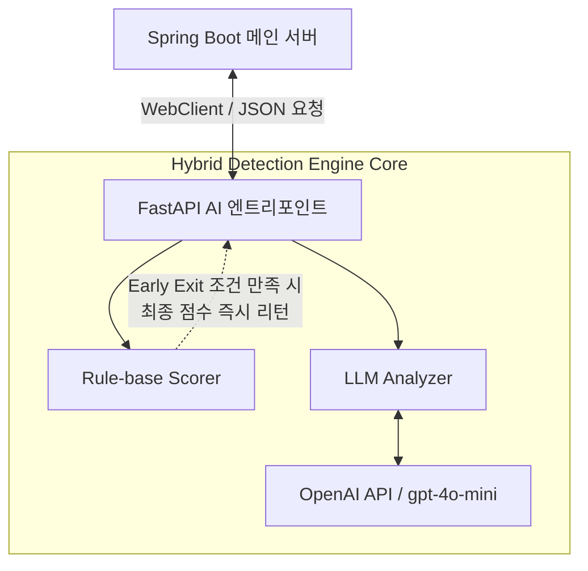

# AI 기반 피싱 탐지 코어 엔진 (AI/ML 파트)

## 프로젝트 소개

본 프로젝트는 지능화되는 피싱 이메일 위협에 대응하기 위해 개발된 **지능형 하이브리드 피싱 탐지 코어 엔진**입니다. 단순한 텍스트 매칭이나 블랙리스트 기반 차단의 한계를 극복하고, 규칙 기반의 고속 패턴 계량화 알고리즘과 대형 언어 모델(LLM)의 사회공학적 문맥 분석을 유기적으로 결합한 다차원 위협 평가 시스템을 구축하는 것을 목적으로 합니다.

명확한 역할 분담과 컴포넌트 독립성을 보장하기 위해, 메인 백엔드 서버(Spring Boot)에 종속되지 않고 자체적으로 고성능 연산을 수행할 수 있도록 **FastAPI 기반의 경량 비동기 AI 서버** 아키텍처 형태로 설계 및 구현되었습니다.

## 문제 정의

최근의 피싱 메일은 정상 도메인의 문자열을 미세하게 변형하는 타이포스쿼팅(Typosquatting) 기법과 긴급성·공포심을 유도하는 사회공학적 징후를 결합하여 전통적인 보안 필터링 장치를 무력화합니다. 본 엔진은 이러한 고위험 메일을 실시간으로 정밀 탐지하기 위해 수 밀리초 단위의 규칙 탐지와 정교한 문맥 분석이 결합된 하이브리드 제어 파이프라인의 부재를 해결하고자 개발되었습니다.

## 주요 기능

* **Rule-base Scorer (패턴 기반 위험도 계산 엔진)**
  * 정규식(`re`)을 활용한 이메일 본문 내 악성 URL 추출 및 파싱
  * `tldextract` 라이브러리를 활용한 Subdomain / Domain / Suffix 분리 및 사칭 도메인 식별
  * IP 주소 직접 접속 패턴, URL 단축 서비스 악용 여부 등 6가지 위험 지표 기반 가중치 스코어링 기능 구현
* **LLM Analyzer (지능형 문맥 분석 엔진)**
  * OpenAI API (`gpt-4o-mini`) 기반의 사회공학적 공격 패턴(비밀번호 변경 유도, 결제 촉구 등) 심층 탐지
  * 정밀한 프롬프트 엔지니어링을 통해 탐지 결과의 신뢰성을 확보하고, 자동 파싱이 가능한 엄격한 JSON 포맷 응답 구조화
* **Early Exit 하이브리드 제어 정책**
  * 규칙 기반 분석 레이어에서 명확한 고위험 패턴이 식별될 경우, 비용이 많이 드는 LLM API 호출을 즉시 생략(Exit)하여 응답 인터벌 단축 및 자원 최적화 달성

## 기술 스택

* **Language:** Python 3.x
* **Core Framework:** FastAPI / Uvicorn
* **AI & NLP Vendor:** OpenAI API (GPT-4o-mini)
* **Text Mining & Processing:** tldextract, re (정규식 모듈)
* **Dependencies:** requirements.txt 표준 의존성 준수

## 아키텍처 및 구조



### 아키텍처 책임 설명
* **FastAPI AI 엔트리포인트:** 메인 백엔드 인프라로부터 이메일 본문 데이터를 비동기로 수신하여 분석 파이프라인을 제어합니다. (`main.py` 구조 근거)
* **Rule-base Scorer:** `url_analyzer.py`와 `scorer.py` 스크립트를 근거로 동작하며, 문자열 기반의 위험 요소를 초고속으로 1차 계량화합니다.
* **LLM Analyzer:** `llm_analyzer.py` 스크립트를 근거로 동작하며, 사회공학적 사칭 문맥을 파악하여 구조화된 위험 평가 데이터를 OpenAI 파이프라인과 주고받습니다.

## 핵심 구현 포인트

### Early Exit 하이브리드 파이프라인 알고리즘 설계
속도 중심의 규칙 탐지와 지능 중심의 LLM 문맥 분석을 계층형으로 결합하였습니다. 1차 위험도 산출 결과가 설정된 임계치를 초과하면 시스템이 조기에 결론을 도출하도록 제어하여 실시간성(Real-time)을 확보하고 불필요한 호출 비용을 혁신적으로 절감하였습니다.

### tldextract 기반 타이포스쿼팅 정밀 식별
일반적인 정규식 매칭의 한계를 보완하기 위해 도메인의 최상위 식별값(TLD)을 분리해 주는 `tldextract` 모듈을 도입하였습니다. 이를 통해 서브도메인 변형이나 사칭 패턴을 촘촘히 분리하여 탐지 정확도를 고도화하였습니다.

### OpenAI API 구조화 데이터(JSON Object) 강제
LLM 응답의 비정형 텍스트 리턴 문제를 방지하기 위해 프롬프트 내 가이드라인 튜닝 및 `response_format={"type": "json_object"}` 설정을 적용하여, 예외 처리 안정성을 보장하고 신뢰성 높은 데이터 파싱 아키텍처를 구현했습니다.

## 트러블슈팅 및 기술적 고민

### 협업 과정에서의 도메인 레이어 분리 및 컴포넌트 독립성 수호
* **문제 상황:** 프로젝트 초기 설계 단계에서 팀 내 프레임워크 조율 미스로 인해 백엔드 메인 루트 디렉토리에 본 AI 엔진 소스 코드 파일들(`url_analyzer.py`, `scorer.py`, `llm_analyzer.py`)이 모듈 분리 없이 혼재되어 적재되었습니다. 이로 인해 AI 파트 고유의 알고리즘 기여도가 희석되고, 서빙 인프라와 결합도가 극도로 높아지는 구조적 결함이 발견되었습니다.
* **해결 방법:** 정석적인 멀티 서버 아키텍처 패러다임을 제안하여 메인 백엔드는 지정 요건인 Spring Boot로 분리 이관시키고, 본 AI 엔진은 오직 핵심 연산 및 API 제어에만 집중할 수 있도록 독립된 FastAPI 패키지 구조로 완벽하게 리팩토링 및 격리 처리하였습니다. 이를 통해 컴포넌트 간 경계를 확립하고 독립적인 배포 및 최적화가 가능한 클린 구조를 완성하였습니다.

## 설치 및 실행 방법

1. AI 엔진 구동에 필요한 파이썬 패키지 의존성을 설치합니다.
```bash
pip install -r requirements.txt
```
2. 루트 디렉토리에 .env 파일을 생성하고 발급받은 OpenAI API 키를 입력합니다.
```bash
OPENAI_API_KEY=your_openai_api_key_here
```
3. Uvicorn 서버 엔진을 통해 로컬 및 서빙 환경에서 코어 서버를 구동합니다.
```bash
uvicorn main:app --reload
```

## 폴더 구조
```
├── core/
│   └── ai/
│       ├── main.py            # FastAPI 엔트리포인트 및 라우터 제어
│       ├── url_analyzer.py    # 정규식 기반 URL 추출 및 tldextract 도메인 분석 모듈
│       ├── scorer.py          # 규칙 기반 패턴 가중치 및 위험도 1차 스코어링 엔진
│       ├── llm_analyzer.py    # OpenAI API 연동 및 사회공학적 문맥 탐지 모듈
│       └── analyzer.py        # 1차 스코어링, OpenAI API로 2차 스코어링한 뒤 최종 합계
└── requirements.txt           # 엔진 구동을 위한 파이썬 라이브러리 명세
```

## 배운 점

- 하이브리드 알고리즘 파이프라인 설계: 리소스가 가벼운 규칙 기반 탐지와 무거운 LLM 지능형 탐지를 유기적으로 엮어내는 설계 경험을 통해, 효율성과 정확도의 트레이드오프(Trade-off)를 제어하는 감각을 체득했습니다.
- 소프트웨어 모듈화와 책임 격리의 필연성: 컴포넌트 경계 붕괴 이슈를 아키텍처 리팩토링으로 직접 해결해 보며, 협업 프로젝트에서 패키지 간의 독립성이 유지보수와 개별 기여도 증명에 미치는 치명적인 영향력을 깊이 깨달았습니다.

## 향후 개선 사항

- 자체 룰베이스 데이터셋 확장: 공공 데이터셋(KISA 등)과의 연동을 넓혀 타이포스쿼팅 및 단축 URL 패턴에 대한 가중치 사전을 더 정밀하게 고도화
- 비동기 큐(Queue) 도입 고려: 분석 요청 트래픽 급증 시 발생할 수 있는 LLM API 병목 현상을 방지하기 위해 Celery 등의 태스크 큐 기반 비동기 처리 아키텍처 검토
