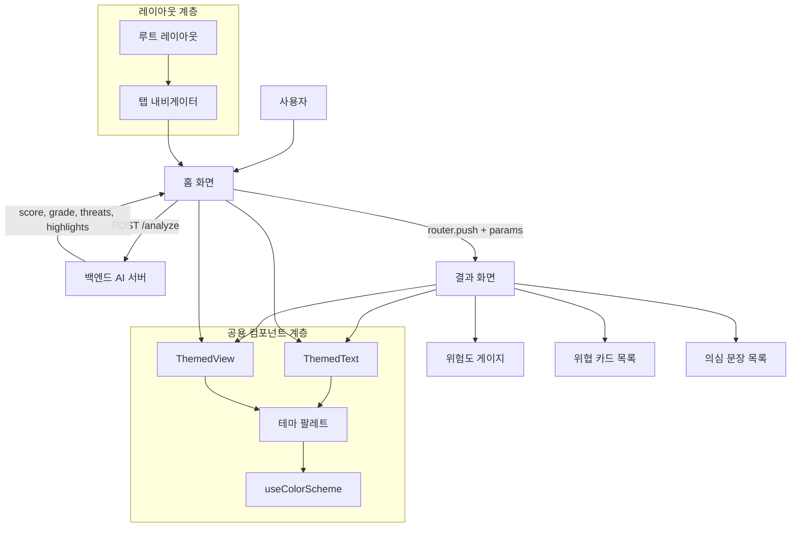

# AI 기반 피싱 메일 정밀 분석 앱 — 프론트엔드

## 프로젝트 소개

본 프로젝트의 프론트엔드는 AI 피싱 메일 분석 시스템의 사용자 접점을 담당하는 크로스 플랫폼 모바일 애플리케이션입니다. 사용자가 의심스러운 이메일 본문을 입력하면 백엔드 AI 분석 엔진으로 요청을 전달하고, 반환된 위험도 점수·위협 요소·의심 문장을 직관적인 시각 요소로 렌더링하여 보안 지식이 없는 일반 사용자도 피싱 여부를 즉각 판단할 수 있도록 돕습니다.

**React Native + Expo** 기반으로 iOS, Android, Web을 단일 코드베이스에서 지원하며, **TypeScript**로 전 컴포넌트의 타입 안전성을 확보하였습니다. **Expo Router**의 파일 기반 라우팅 구조를 채택하여 화면 구조와 URL 체계를 일치시켰고, `app.json`의 `newArchEnabled: true` 및 `experiments.reactCompiler: true`를 통해 Expo 54의 New Architecture(JSI 기반)와 React Compiler 실험 기능을 적용해 최신 Expo 생태계의 렌더링 최적화 기반을 갖추었습니다.

---

## 문제 정의

피싱 탐지 결과를 단순 텍스트나 수치로만 제공할 경우, 보안 지식이 없는 일반 사용자는 결과의 의미를 해석하거나 위협 수준을 체감하기 어렵습니다. 기술적 차단 시스템의 탐지 결과는 존재하더라도 사용자에게 **어떤 문장이 왜 위험한지**를 구체적으로 전달하는 시각적 인터페이스가 부재한 경우가 많습니다.

본 프론트엔드는 분석 결과를 **0~100 위험도 점수의 애니메이션 게이지**, **위협 요소 카드 목록**, **의심 문장 하이라이트**의 세 가지 계층으로 시각화함으로써, 사용자가 위협의 존재를 직관적으로 인지하고 해당 판단 근거까지 함께 확인할 수 있는 UX를 제공하는 것을 목표로 합니다.

---
 
## 주요 기능

- **이메일 본문 입력 및 분석 요청** — `app/(tabs)/index.tsx`에서 멀티라인 `TextInput`으로 이메일 본문을 입력받고, `POST /analyze` 요청을 통해 백엔드 AI 서버로 전송합니다.
- **로딩 상태 제어** — 분석 요청 중에는 버튼을 비활성화하고 `ActivityIndicator`를 렌더링하여 중복 요청 및 사용자 혼란을 방지합니다.
- **위험도 게이지 애니메이션** — `components/risk-gauge.tsx`의 `RiskGauge` 컴포넌트가 분석 점수(0~100)를 1초 duration의 `Animated.timing`으로 채워지는 바 형태로 표시하며, 안전(초록) / 주의(노랑) / 위험(빨강) 3단계 색상을 동적으로 적용합니다.
- **위협 요소 카드 목록** — `components/threat-card.tsx`의 `ThreatCard` 컴포넌트가 백엔드가 반환한 `threats` 배열을 항목별 카드로 렌더링합니다.
- **의심 문장 하이라이트** — `highlight_sentences` 배열을 좌측 강조 보더(`borderLeftColor`)와 함께 시각적으로 구분하여 표시합니다.
- **라이트 / 다크 모드 완전 대응** — `useColorScheme` 훅으로 시스템 테마를 감지하고, `constants/theme.ts`에 정의된 색상 팔레트를 전 컴포넌트에 일관되게 적용합니다.
- **Explore 탭** — 현재 Expo 기본 템플릿 내용이 유지 중입니다. `구현 여부 확인 필요`
- **모달 화면** — `app/modal.tsx`가 존재하나 실제 진입점 및 사용 여부 `확인 필요`

---

## 기술 스택

### Framework & Runtime

| 항목 | 버전 |
|------|------|
| React Native | 0.81.5 |
| Expo | ~54.0.33 |
| React | 19.1.0 |

### Language & Tooling

| 항목 | 버전 |
|------|------|
| TypeScript | ~5.9.2 |
| ESLint + eslint-config-expo | 9.x |

### 라우팅 & 내비게이션

| 항목 | 버전 |
|------|------|
| Expo Router | ~6.0.23 |
| React Navigation (native, bottom-tabs) | ^7.x |

### 애니메이션 & 제스처

| 항목 | 버전 |
|------|------|
| React Native Reanimated | ~4.1.1 |
| React Native Gesture Handler | ~2.28.0 |

### 멀티플랫폼

| 항목 | 버전 |
|------|------|
| react-native-web | ~0.21.0 |

> `react-native-worklets`: 의존성 기준 확인 — 실제 사용 코드 위치 미확인

---

## 아키텍처 및 구조



**다이어그램 근거:**

- `홈 화면`: `app/(tabs)/index.tsx` 내 `fetch('http://localhost:8000/analyze', { method: 'POST' })` 확인
- `router.push + params`: `router.push({ pathname: '/result', params: { score, grade, threats, highlight_sentences } })` 확인
- `결과 화면`: `app/result.tsx` 확인
- `RiskGauge`, `ThreatCard`: `app/result.tsx` import 및 렌더링 확인
- `루트 레이아웃`: `app/_layout.tsx` (Stack Navigator + ThemeProvider) 확인
- `탭 내비게이터`: `app/(tabs)/_layout.tsx` (Tabs Navigator) 확인
- `공용 컴포넌트 계층`: `components/themed-text.tsx`, `components/themed-view.tsx`, `constants/theme.ts`, `hooks/use-color-scheme.ts` 확인

앱은 Expo Router의 파일 기반 라우팅 규칙에 따라 `app/` 디렉토리 구조가 곧 화면 라우팅 구조입니다. 최상위 `app/_layout.tsx`가 Stack Navigator와 `ThemeProvider`를 설정하고, `app/(tabs)/_layout.tsx`가 하단 탭 내비게이션을 구성합니다.

핵심 화면은 **이메일 입력 화면**(`index.tsx`)과 **분석 결과 화면**(`result.tsx`) 두 개이며, 데이터 흐름은 `API 응답 → URL 파라미터 직렬화 → 결과 화면 수신`의 단방향 구조입니다. Redux, Zustand 등 전역 상태 관리 라이브러리 없이 Expo Router의 `params` 기능만으로 화면 간 데이터 전달을 처리합니다.

공용 컴포넌트(`ThemedText`, `ThemedView`)와 `constants/theme.ts`는 라이트/다크 색상 팔레트를 중앙 집중식으로 관리하며, 모든 화면과 컴포넌트가 `useColorScheme` 훅을 통해 시스템 테마를 감지하고 동일한 방식으로 색상을 적용합니다.

---

## 핵심 구현 포인트

**1. Expo Router 파일 기반 라우팅 + URL 파라미터 기반 화면 간 데이터 전달**

Redux, Zustand 등 전역 상태 관리 라이브러리 없이 `router.push`의 `params` 옵션으로 API 응답 데이터를 직렬화(`JSON.stringify`)하여 결과 화면에 전달하고, `useLocalSearchParams`로 수신하는 구조를 채택했습니다. 의존성을 최소화하면서도 화면 간 데이터 흐름을 명확하게 유지할 수 있는 방식입니다. (`app/(tabs)/index.tsx`, `app/result.tsx` 참조)

**2. React Native Animated를 활용한 위험도 게이지 애니메이션**

`components/risk-gauge.tsx`에서 `Animated.Value`와 `Animated.timing`(duration: 1000ms)으로 게이지 바가 분석 점수까지 부드럽게 채워지는 진입 애니메이션을 구현했습니다. `interpolate`로 0~100 점수를 `'0%'~'100%'` 너비로 변환하고, 점수 구간(0~29 안전 / 30~59 주의 / 60~100 위험)에 따라 색상(`#4CAF50` / `#FFC107` / `#F44336`)이 동적으로 결정됩니다.

**3. 테마 토큰 기반 다크 모드 대응 설계**

`constants/theme.ts`에서 `light` / `dark` 색상 팔레트를 중앙 집중식으로 정의하고, `ThemedText`·`ThemedView` 공용 컴포넌트가 `useColorScheme` 훅으로 시스템 테마를 감지하여 색상을 자동 주입하는 구조입니다. 컴포넌트 내부에 색상 값을 직접 하드코딩하지 않음으로써 테마 전환 시 전체 앱의 색상 일관성을 단일 지점에서 보장합니다.

**4. 비동기 API 통신 및 단계적 에러 핸들링**

`index.tsx`의 `handleAnalyze` 함수에서 `fetch` + `async/await` 패턴으로 백엔드에 POST 요청을 전송하고, `isAnalyzing` 상태로 로딩 UI를 제어합니다. `try/catch/finally` 구조와 `response.ok` 검증을 통해 네트워크 오류와 서버 오류(4xx/5xx)를 분기 처리하여, 어떤 경우에도 로딩 상태가 정상 복구되도록 설계했습니다.

**5. Expo New Architecture 및 React Compiler 실험 기능 적용**

`app.json`의 `newArchEnabled: true`로 JSI(JavaScript Interface) 기반의 New Architecture를 활성화하고, `experiments.reactCompiler: true`로 React Compiler 실험 기능을 적용하여 Expo 54의 최신 렌더링 파이프라인 기반을 갖추었습니다.

---

## 트러블슈팅 및 기술적 고민

### 화면 간 데이터 전달 방식 선택 문제

- **문제 상황:** 홈 화면에서 API 응답으로 받은 `threats`(배열)와 `highlight_sentences`(배열)를 결과 화면으로 전달해야 했습니다. Expo Router의 URL 파라미터는 문자열만 허용하기 때문에 객체 및 배열 타입을 그대로 넘길 수 없는 제약이 있었습니다.
- **해결 방법:** 배열 데이터를 `JSON.stringify`로 직렬화하여 파라미터로 전달하고, 결과 화면(`result.tsx`)에서 `JSON.parse`로 역직렬화하는 방식을 채택했습니다. 전역 상태 관리 라이브러리 도입 없이 단방향 데이터 흐름을 유지하면서 타입 불일치 문제를 해결했습니다.


## 설치 및 실행 방법

1. 의존성 패키지를 설치합니다.

```bash
npm install
```

2. 백엔드 AI 분석 서버가 `localhost:8000`에서 실행 중인지 확인합니다.
   실제 디바이스에서 테스트할 경우, `app/(tabs)/index.tsx`의 API URL 상수를 서버의 실제 IP 주소로 변경해야 합니다.

```typescript
// app/(tabs)/index.tsx
const API_URL = 'http://localhost:8000/analyze'; // 실제 디바이스 테스트 시 IP 변경 필요
```

3. Expo 개발 서버를 시작합니다.

```bash
npx expo start
```

4. 플랫폼별 실행 옵션을 선택합니다.

```bash
npm run ios      # iOS 시뮬레이터
npm run android  # Android 에뮬레이터
npm run web      # 웹 브라우저
```

> `.env` 환경 변수 파일은 현재 코드베이스에서 확인되지 않았습니다. 추가 환경 설정이 필요한 경우 별도 명세가 필요합니다.

---

## 폴더 구조

```text
phishing-mail-ai/
├── app/                          # 화면 (Expo Router 파일 기반 라우팅)
│   ├── _layout.tsx               # 루트 레이아웃 — Stack Navigator + ThemeProvider
│   ├── (tabs)/
│   │   ├── _layout.tsx           # 하단 탭 내비게이터
│   │   └── index.tsx             # 홈 화면 — 이메일 입력 및 분석 요청
│   ├── result.tsx                # 분석 결과 화면 — 게이지, 위협 카드, 의심 문장
│   └── modal.tsx                 # 모달 화면 (사용 여부 확인 필요)
├── components/                   # 재사용 UI 컴포넌트
│   ├── risk-gauge.tsx            # Animated 기반 위험도 게이지
│   ├── threat-card.tsx           # 위협 요소 카드
│   ├── themed-text.tsx           # 테마 대응 텍스트 컴포넌트
│   ├── themed-view.tsx           # 테마 대응 View 컴포넌트
│   └── ui/                       # 범용 UI (아이콘, Collapsible 등)
├── constants/
│   └── theme.ts                  # 라이트/다크 색상 팔레트 및 폰트 토큰 정의
├── hooks/
│   ├── use-color-scheme.ts       # 시스템 테마 감지 훅
│   └── use-theme-color.ts        # 테마 색상 추출 훅
├── assets/images/                # 앱 아이콘 및 스플래시 이미지
├── app.json                      # Expo 앱 설정 (New Architecture, React Compiler 등)
└── package.json
```

---

## 배운 점

- **Expo Router 파일 기반 라우팅 구조:** 폴더·파일 이름이 곧 URL 체계가 되는 구조를 직접 설계하면서 Stack과 Tabs를 혼합한 내비게이션 계층 구조를 구성하는 방법을 익혔습니다.
- **React Native 애니메이션 구현 원리:** `Animated.Value`, `Animated.timing`, `interpolate`를 직접 사용해 선언적 애니메이션을 구성하는 방법을 학습하고, 위험도 게이지 컴포넌트에 실제로 적용했습니다.
- **컴포넌트 기반 테마 시스템 설계:** 색상 값을 컴포넌트 내부에 직접 작성하지 않고 `constants/theme.ts`와 공용 컴포넌트로 분리함으로써, 다크 모드 전환 시 전체 앱의 색상 일관성을 단일 지점에서 제어하는 설계 방식을 경험했습니다.
- **REST API 비동기 통신 및 상태 관리:** `fetch` + `async/await` 조합으로 외부 API와 통신하고, 로딩·에러·성공 상태를 로컬 `useState`로 제어하는 패턴을 실습했습니다.
- **크로스 플랫폼 앱 구조 이해:** `react-native-web`과 Expo를 통해 iOS, Android, Web을 단일 코드베이스로 지원하는 크로스 플랫폼 개발 방식을 직접 경험했습니다.

---

## 향후 개선 사항

- **API URL 환경 변수 분리:** 현재 `localhost:8000`으로 하드코딩된 API URL을 `.env` 파일 기반 환경 변수로 분리하여 개발/운영 환경 전환을 용이하게 개선
- **에러 처리 UI 고도화:** 현재 `alert()`로 처리 중인 오류 메시지를 인라인 토스트 또는 에러 배너 컴포넌트로 교체하여 사용자 경험 개선
- **분석 이력 영속화:** AsyncStorage 또는 서버 DB와 연동하여 과거 분석 결과를 조회할 수 있는 이력 기능 추가 검토
- **접근성(Accessibility) 보강:** `accessibilityLabel`, `accessibilityRole` 등 React Native 접근성 속성 적용
- **컴포넌트 단위 테스트 추가:** `RiskGauge`, `ThreatCard` 등 핵심 컴포넌트에 대한 Jest 기반 테스트 작성
- **Explore 탭 기능 구체화:** 현재 Expo 기본 템플릿 내용이 유지 중인 Explore 탭을 앱 사용 가이드 또는 보안 리터러시 콘텐츠 화면으로 대체

---
