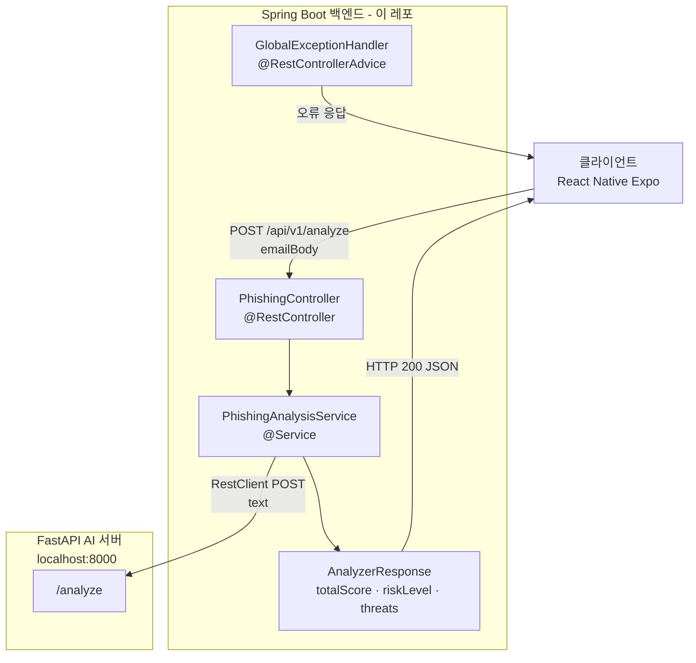

# Phishing Mail AI — Backend Server

> AI 기반 피싱 메일 분석 플랫폼의 **Spring Boot 메인 백엔드 서버** > 브랜치: `6-phishing-mail-ai-backend`

---

## 프로젝트 소개

본 레포지토리는 AI 기반 피싱 메일 정밀 분석 서비스의 **백엔드 API 서버**입니다. 사용자가 의심스러운 이메일 본문을 입력하면, 이 서버가 요청을 수신하고 Python FastAPI AI 분석 서버(`6-phishing-mail-ai-ai-ml` 브랜치)에 분석을 위임한 뒤 결과를 클라이언트에 가공하여 반환합니다.

전체 시스템은 Spring Boot(API 서빙·라우팅) + FastAPI(AI 분석 엔진) + React Native Expo(프론트엔드)로 역할을 나눈 멀티 서버 아키텍처로 구성되어 있으며, 본 서버는 그 중 외부 클라이언트와 AI 엔진 사이의 **중재자(Mediator)** 역할을 담당합니다.

Spring Boot 4.0.6 및 Java 17 환경에서 구축되었고, `RestClient`, `Lombok`, Bean Validation을 활용하여 AI 서버와의 HTTP 통신 및 요청/응답 데이터 처리를 구현하였습니다.

---

## 문제 정의

피싱 메일 탐지를 위한 AI 분석 연산은 Python 생태계(OpenAI API, tldextract 등)에 특화되어 있는 반면, 안정적인 API 서빙·요청 유효성 검증·예외 핸들링 등의 서버 인프라 역할은 Spring Boot가 더 적합합니다.

이 두 언어/프레임워크의 강점을 동시에 취하면서도 클라이언트에게 단일 엔드포인트를 제공하기 위해, **Spring Boot를 API 게이트웨이 역할의 메인 서버**로, **FastAPI를 AI 연산 전담 독립 서버**로 분리하는 구조를 설계하였습니다. 본 서버는 이 구조에서 클라이언트 요청의 유일한 진입점을 담당합니다.

---

## 주요 기능

- **피싱 메일 분석 API 제공** (`POST /api/v1/analyze`)  
  클라이언트로부터 이메일 본문(`emailBody`)을 수신하고 분석 결과를 반환합니다. (`PhishingController.java` 기반)

- **요청 유효성 검증** `@NotBlank` Bean Validation을 통해 빈 본문 입력 시 즉시 오류 응답을 반환합니다. (`AnalyzeRequest.java` 기반)

- **FastAPI AI 서버 연동** Spring 6.1에서 도입된 `RestClient`를 사용해 AI 서버(`http://localhost:8000/analyze`)에 JSON 형식으로 분석 요청을 전달하고 결과를 파싱합니다. (`PhishingAnalysisService.java` 기반)

- **응답 데이터 가공 및 정규화** AI 서버로부터 수신한 `score`, `grade`, `threats` 데이터를 클라이언트 스펙에 맞는 `AnalyzeResponse` 구조로 변환합니다. `grade` 값이 null인 경우 기본값 `"낮음"`을 세팅하는 방어 로직이 포함되어 있습니다.

- **AI 서버 장애 시 Fallback 응답 처리** `RestClient` 호출 중 예외 발생 시 `score: 0`, `riskLevel: "서버 연결 실패"` 형태의 안전망 응답을 반환하여 서비스 전체 중단을 방지합니다. (`PhishingAnalysisService.java` 기반)

- **전역 예외 핸들링** `@RestControllerAdvice`를 적용한 `GlobalExceptionHandler`를 통해 애플리케이션 전역의 예외를 일관된 JSON 오류 응답 포맷으로 처리합니다.

- **CORS 설정** `@CrossOrigin(origins = "*")`을 통해 개발 환경에서 모든 오리진의 요청을 허용합니다.

---

## 기술 스택

| 분류 | 기술 |
|------|------|
| Framework | Spring Boot 4.0.6 |
| Language | Java 17 |
| Build Tool | Gradle (Wrapper 포함) |
| HTTP 클라이언트 | `RestClient` (Spring 6.1+) |
| 유효성 검증 | `spring-boot-starter-validation` (`@NotBlank`) |
| 코드 간결화 | Lombok (`@RequiredArgsConstructor`, `@Getter`, `@Builder`, `@Slf4j`) |
| 테스트 | JUnit 5 (`spring-boot-starter-webmvc-test`) |
| 연동 대상 | FastAPI AI 서버 (Python, `6-phishing-mail-ai-ai-ml` 브랜치) |

> ⚠️ `build.gradle` 의존성 기준으로 `spring-boot-starter-security`는 포함되어 있지 않습니다. CORS는 컨트롤러의 `@CrossOrigin` 어노테이션으로 처리합니다.

---

## 아키텍처 및 구조



**구조 설명**

`PhishingController`는 `POST /api/v1/analyze` 단일 엔드포인트를 정의하며, Bean Validation이 적용된 `AnalyzeRequest`를 통해 입력값 검증을 수행합니다.

`PhishingAnalysisService`는 핵심 비즈니스 로직을 담당합니다. `RestClient`로 FastAPI 서버에 요청을 전달하고, 응답을 서비스 내부에 선언된 `FastApiResponse` record로 역직렬화한 뒤, 클라이언트 응답 포맷인 `AnalyzeResponse`로 변환합니다. AI 서버 장애 시에는 fallback 응답을 반환합니다.

`RestClientConfig`는 `RestClient` Bean을 별도 `@Configuration` 클래스에서 등록하여 서비스 레이어와의 결합도를 낮춥니다.

`GlobalExceptionHandler`는 `@RestControllerAdvice`로 전역 예외를 처리하며, `error`와 `message` 필드를 포함한 일관된 오류 응답 구조를 반환합니다.

---

## 핵심 구현 포인트

### 1. RestClient를 활용한 AI 서버 HTTP 통신

Spring 6.1에서 도입된 `RestClient`를 `RestClientConfig`에서 Bean으로 등록하고, `PhishingAnalysisService`에 주입하여 FastAPI 서버 호출에 활용합니다.

```java
// PhishingAnalysisService.java
FastApiResponse aiResponse = restClient.post()
    .uri(AI_SERVER_URL)
    .contentType(MediaType.APPLICATION_JSON)
    .body(Map.of("text", body))
    .retrieve()
    .body(FastApiResponse.class);
```

### 2. Java Record로 AI 응답 역직렬화

FastAPI 응답 구조를 서비스 내부 `record`로 선언하여 불변성 보장 및 코드 간결화를 달성하였습니다.

```java
// PhishingAnalysisService.java 내부 선언
public record FastApiResponse(
    int score,
    String grade,
    List<String> threats,
    List<String> urls,
    List<String> highlight_sentences) {}
```

### 3. Null-safe Fallback 처리 설계

AI 서버로부터 `grade` 값이 누락되는 경우를 대비해 기본값을 명시적으로 세팅하고, 통신 자체가 실패할 경우 안전망 응답을 반환하도록 이중 방어 로직을 설계하였습니다.

```java
String finalRiskLevel = aiResponse.grade() != null ? aiResponse.grade() : "낮음";
```

### 4. Builder 패턴 기반 응답 객체 구성

`AnalyzeResponse`와 내부 `ThreatElement`에 Lombok `@Builder`를 적용하여, 서비스 레이어에서 가독성 높은 응답 객체 생성이 가능합니다.

### 5. @RestControllerAdvice 전역 예외 분리

`GlobalExceptionHandler`를 컨트롤러와 독립된 클래스로 분리하여, 모든 예외를 `{ "error": "...", "message": "..." }` 구조의 일관된 JSON 응답으로 처리하도록 구성하였습니다.

---

## 트러블슈팅 및 기술적 고민

### Spring Boot 아키텍처 전환 과정

초기 설계 단계에서 Python 단일 서버 구조로 개발이 진행되던 중, AI 연산 영역과 서버 인프라 영역을 역할에 따라 분리할 필요성이 제기되었습니다. 팀 내 기술 조율을 통해 메인 서버를 Spring Boot로 전환하고, AI 엔진은 FastAPI 독립 서버로 격리하는 구조로 재설계하였습니다. 이 과정에서 컴포넌트 경계 설계가 유지보수 및 역할 분담 명확성에 미치는 영향을 직접 경험하였습니다.

### AI 서버 URL 하드코딩 문제

현재 `PhishingAnalysisService.java`에 AI 서버 URL이 `"http://localhost:8000/analyze"`로 하드코딩되어 있습니다. 이는 개발 환경에서는 동작하지만, 배포 환경에서는 `application.properties`를 통한 외부화가 필요합니다. 향후 개선 대상으로 인식하고 있습니다.

---

## 설치 및 실행 방법

### 사전 조건

- Java 17 이상
- FastAPI AI 서버가 `http://localhost:8000`에서 구동 중이어야 합니다 (`6-phishing-mail-ai-ai-ml` 브랜치 참조)

### 브랜치 체크아웃 및 실행

```bash
# 1. 클론 및 브랜치 이동
git clone https://github.com/seung-yeonn/phishing-mail-ai.git
cd phishing-mail-ai
git checkout 6-phishing-mail-ai-backend
cd backend

# 2. 빌드
./gradlew build

# 3. 실행 (기본 포트: 8080)
./gradlew bootRun
```

### API 테스트

```bash
curl -X POST http://localhost:8080/api/v1/analyze \
  -H "Content-Type: application/json" \
  -d '{"emailBody": "즉시 비밀번호를 변경하지 않으면 계정이 정지됩니다."}'
```

**정상 응답 예시**

```json
{
  "totalScore": 45,
  "riskLevel": "주의",
  "threats": [
    { "content": "즉시", "type": "AI 탐지 위협" },
    { "content": "비밀번호", "type": "AI 탐지 위협" }
  ]
}
```

---

## 폴더 구조

```
backend/
├── src/
│   ├── main/java/com/_team/backend/
│   │   ├── BackendApplication.java            # Spring Boot 진입점
│   │   ├── controller/
│   │   │   └── PhishingController.java        # POST /api/v1/analyze 엔드포인트
│   │   ├── service/
│   │   │   └── PhishingAnalysisService.java   # RestClient 연동 및 응답 가공
│   │   ├── dto/
│   │   │   ├── AnalyzeRequest.java            # 요청 DTO (@NotBlank 검증)
│   │   │   └── AnalyzeResponse.java           # 응답 DTO (Builder + ThreatElement)
│   │   ├── config/
│   │   │   └── RestClientConfig.java          # RestClient Bean 등록
│   │   └── exception/
│   │       └── GlobalExceptionHandler.java    # 전역 예외 처리
│   └── test/java/com/_team/backend/
│       └── BackendApplicationTests.java       # 컨텍스트 로드 테스트
├── build.gradle                               # 의존성 및 빌드 설정
├── settings.gradle
└── gradlew
```

---

## 배운 점

- **멀티 프레임워크 시스템 설계:** Spring Boot와 FastAPI를 하나의 시스템으로 연동하며, 각 프레임워크의 강점에 따라 역할을 분리하는 설계 방식을 학습하였습니다.
- **RestClient 실전 적용:** Spring 6.1에서 새롭게 도입된 `RestClient` API를 직접 활용하며 `RestTemplate`과의 차이를 체감하였습니다.
- **DTO 설계와 Lombok 조합:** `@Builder`, `@Getter`, `@RequiredArgsConstructor`를 조합하여 불변성과 가독성이 높은 DTO를 설계하는 방법을 체득하였습니다.
- **예외 처리 아키텍처 분리:** `@RestControllerAdvice`를 독립 클래스로 구성하는 패턴을 통해 Separation of Concerns 원칙을 실제 코드에 적용하는 방법을 익혔습니다.
- **컴포넌트 경계 설계의 중요성:** 협업 중 발생한 모듈 혼재 문제를 직접 리팩토링하며, 초기 아키텍처 합의와 패키지 경계 설계가 프로젝트 유지보수에 미치는 영향을 실감하였습니다.

---

## 향후 개선 사항

- **AI 서버 URL 환경 변수 외부화:** `application.properties`를 통해 AI 서버 주소를 주입받도록 개선 필요 (현재 `PhishingAnalysisService.java`에 하드코딩됨)
- **Circuit Breaker 패턴 도입:** Resilience4j를 활용해 FastAPI 서버 장애 시 연쇄 장애를 방지하는 회로 차단기 패턴 적용 검토
- **테스트 커버리지 확충:** 현재는 컨텍스트 로드 테스트만 존재하므로, `PhishingAnalysisService` 단위 테스트 및 `PhishingController` 통합 테스트 추가 필요
- **CORS 정책 강화:** 현재 `@CrossOrigin(origins = "*")`으로 모든 오리진을 허용하고 있어, 운영 환경에서는 허용 오리진을 명시적으로 제한해야 함
- **분석 이력 영속화:** 현재 stateless 구조이므로, 사용자 분석 이력을 DB에 저장하고 보안 리터러시 변화 추이를 통계로 제공하는 기능 추가 검토
